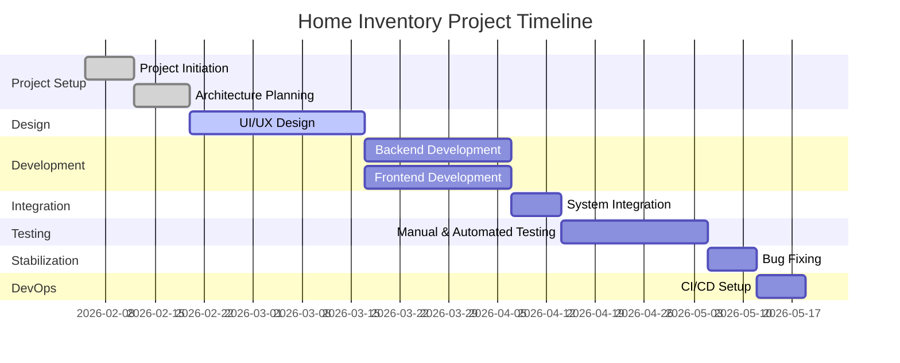

# 3️⃣ Планування проєкту та управління ресурсами

## 1. Загальний опис

Цей документ описує план реалізації проєкту **Home Inventory & Warranty Tracker**.  
Планування включає визначення етапів розробки, ключових дедлайнів, ресурсів команди та потенційних ризиків.

Період реалізації проєкту:

**05.02.2026 – 19.05.2026**

Основна мета планування — забезпечити поетапну розробку продукту, контроль виконання задач та ефективне використання ресурсів команди.

---

# 2. Roadmap проєкту

Roadmap визначає основні фази реалізації проєкту та очікувані результати на кожному етапі.

| Етап | Опис | Період |
|-----|-----|-----|
| Ініціація проєкту | Формування команди, ролей, визначення проблеми та Product Vision | 05.02 – 12.02 |
| Планування | Формування документації, визначення архітектури, планування задач | 12.02 – 20.02 |
| UI/UX дизайн | Розробка прототипів та дизайну інтерфейсу | 20.02 – 17.03 |
| Основна розробка | Реалізація backend та frontend функціоналу | 17.03 – 07.04 |
| Інтеграція системи | Інтеграція frontend та backend | 07.04 – 14.04 |
| Тестування | Manual та automated testing | 14.04 – 05.05 |
| Оптимізація та виправлення помилок | Виправлення багів та стабілізація системи | 05.05 – 12.05 |
| DevOps | Налаштування CI/CD pipeline | 12.05 – 19.05 |

---

# 3. Milestone Plan

Milestones — це ключові контрольні точки проєкту, які дозволяють оцінити прогрес розробки.

---

## Milestone 1 — Ініціація проєкту

📅 Дата: **05.02.2026**

Результати:

- сформована команда
- визначені ролі
- сформовано Product Vision
- створено Project Charter

---

## Milestone 2 — Планування архітектури

📅 Дата: **20.02.2026**

Результати:

- визначено архітектуру системи
- обрано технологічний стек
- визначено структуру бази даних
- сформовано backlog задач

---

## Milestone 3 — UI/UX дизайн

📅 Дата: **17.03.2026**

Результати:

- створені wireframes
- створені прототипи інтерфейсу
- затверджена структура основних сторінок
- підготовлені дизайн-макети

---

## Milestone 4 — Основна розробка

📅 Період: **17.03 – 07.04**

Результати:

Backend:

- API для управління речами
- API для гарантій
- API для історії ремонтів
- збереження фото та документів

Frontend:

- сторінка додавання речей
- список інвентарю
- перегляд деталей речі
- UI для перегляду гарантій

---

## Milestone 5 — Інтеграція системи

📅 Період: **07.04 – 14.04**

Результати:

- frontend інтегрований з backend
- перевірені основні сценарії використання
- базова стабільність системи

---

## Milestone 6 — Тестування

📅 Дата: **14.04.2026**

Результати:

- manual тестування основних функцій
- написані automated тести
- перевірка user flows
- виправлення критичних багів

---

## Milestone 7 — CI/CD

📅 Дата: **19.05.2026**

Результати:

- налаштовано CI/CD pipeline
- автоматичне виконання тестів
- автоматичний деплой системи

---

# 4. Gantt Chart

# 5. Управління ресурсами (Resource Management)

Ефективне управління ресурсами є важливим для забезпечення своєчасного виконання задач та рівномірного розподілу навантаження між учасниками команди.

## Технологічні ресурси

Backend:

- Python
- FastAPI
- PostgreSQL

Frontend:

- React або інший сучасний JavaScript framework

Інфраструктура:

- Docker
- GitHub
- CI/CD pipeline

## Інструменти розробки

- **GitHub** — контроль версій та спільна робота над кодом
- **Figma** — створення UI/UX дизайну та прототипів
- **Postman** — тестування API
- **Docker** — контейнеризація середовища розробки
- **CI/CD tools** — автоматизація тестування та деплою

---

# 6. Управління ризиками (Risk Management)

У процесі розробки програмного забезпечення можуть виникати різні ризики, які можуть вплинути на строки виконання або якість продукту. Для їх мінімізації необхідно заздалегідь визначити потенційні проблеми та способи їх вирішення.

| Ризик | Опис | Ймовірність | Вплив | Стратегія зменшення |
|-----|-----|-----|-----|-----|
| Обмежений час | Обмежені дедлайни можуть ускладнити реалізацію всього функціоналу | Середня | Високий | Зосередитися на реалізації MVP |
| Технічні труднощі | Можливі складнощі під час інтеграції frontend та backend | Середня | Середній | Регулярна інтеграція та тестування |
| Помилки в коді | Баги можуть вплинути на стабільність системи | Висока | Середній | Проведення тестування та code review |
| Нерівномірний розподіл задач | Один учасник може отримати занадто багато задач | Середня | Низький | Перерозподіл задач у команді |
| Затримки у виконанні етапів | Деякі етапи можуть зайняти більше часу ніж планувалося | Середня | Середній | Регулярний контроль прогресу |

---

# 7. Критерії завершення проєкту (Project Completion Criteria)

Проєкт вважається успішно завершеним за умови виконання наступних критеріїв:

- Реалізовано основний функціонал системи управління домашнім інвентарем.
- Користувач може додавати речі, зберігати фотографії та гарантійну інформацію.
- Реалізовано можливість перегляду та редагування даних.
- Система стабільно працює без критичних помилок.
- Проведено manual та automated тестування.
- Виправлено критичні помилки та проведено оптимізацію.
- Налаштовано CI/CD pipeline для автоматизації процесів тестування та деплою.
- Підготовлено фінальну документацію та презентацію проєкту.
